# Architecture Documentation

## System Overview

VSCode Android follows a hybrid architecture combining Tauri's Rust backend with a React frontend, optimized for Android mobile devices.

## High-Level Architecture

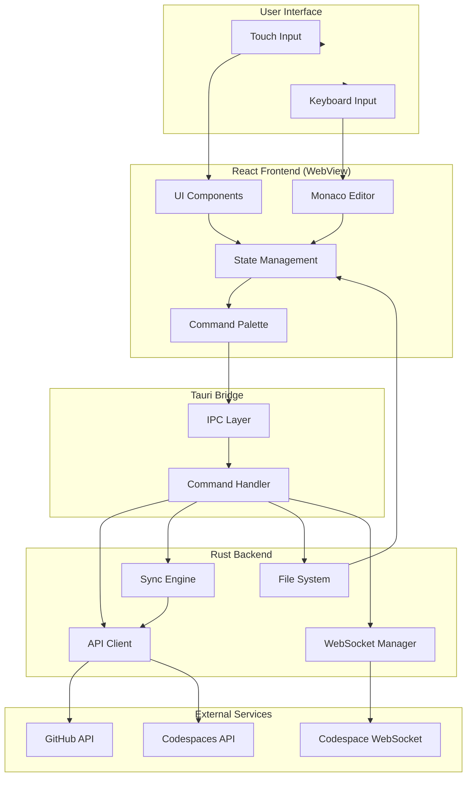

## Component Architecture

### Frontend Components

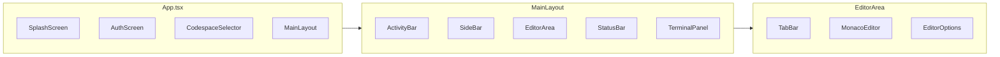

### State Management Flow

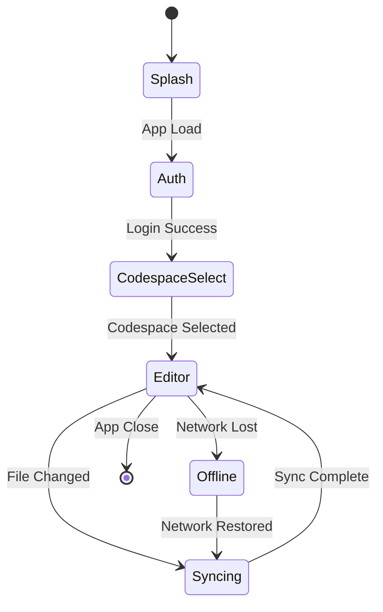

## Data Flow

### Authentication Flow

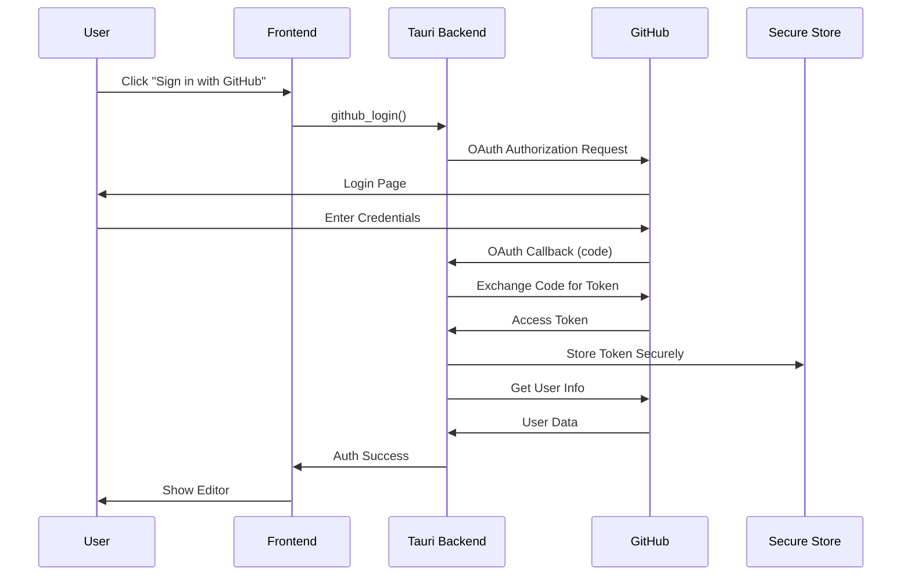

### File Sync Flow

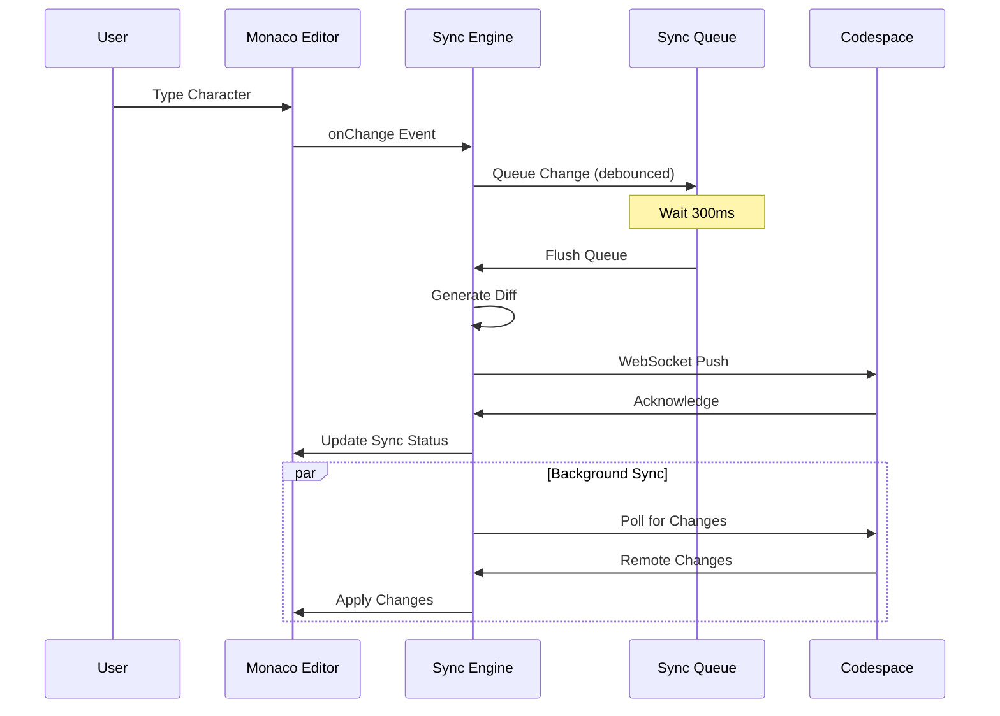

## Sync System Architecture

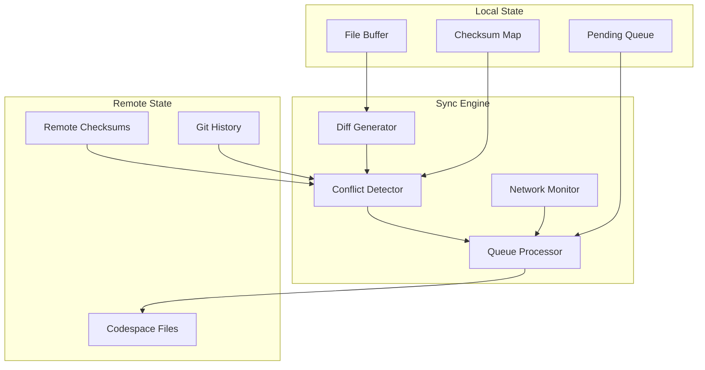

## Conflict Resolution

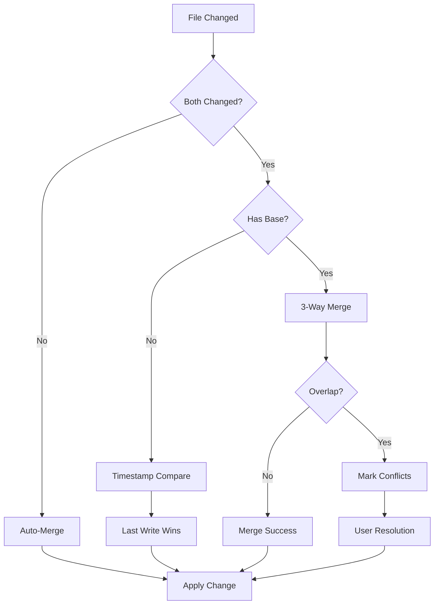

## Mobile Optimizations

### Touch Target Hierarchy

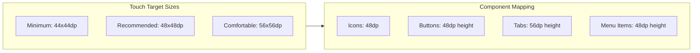

### Responsive Breakpoints

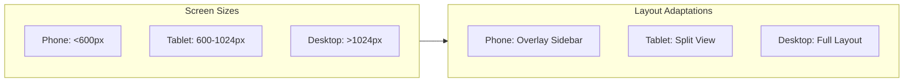

## Security Architecture

```mermaid
graph TB
    subgraph Secure["Secure Storage"]
        S1[Tauri Store (Encrypted)]
        S2[Android Keystore]
    end
    
    subgraph Auth["Authentication"]
        A1[OAuth 2.0 Flow]
        A2[State Verification]
        A3[Token Refresh]
    end
    
    subgraph Network["Network Security"]
        N1[HTTPS Only]
        N2[CSP Headers]
        N3[WebSocket TLS]
    end
    
    Auth --> Secure
    Network --> Secure
```

## Plugin Architecture (Future)

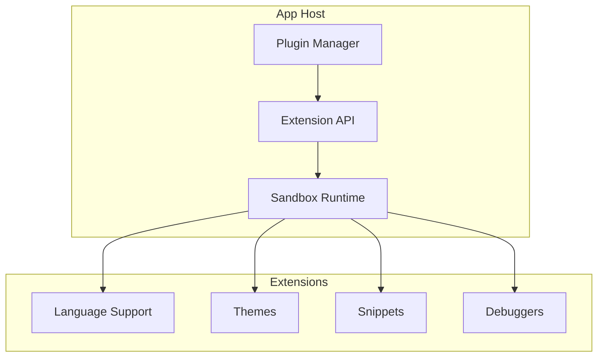

## Performance Considerations

### Memory Management

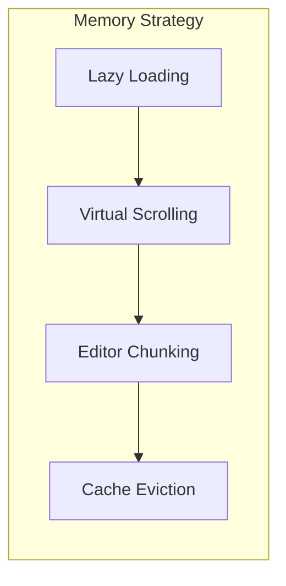

### Network Optimization

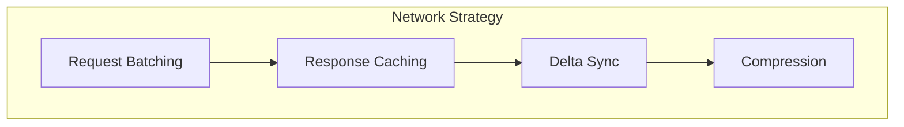

## Testing Architecture

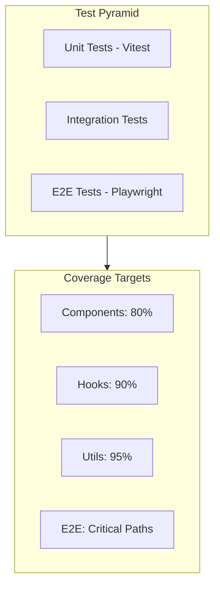

## Deployment Pipeline

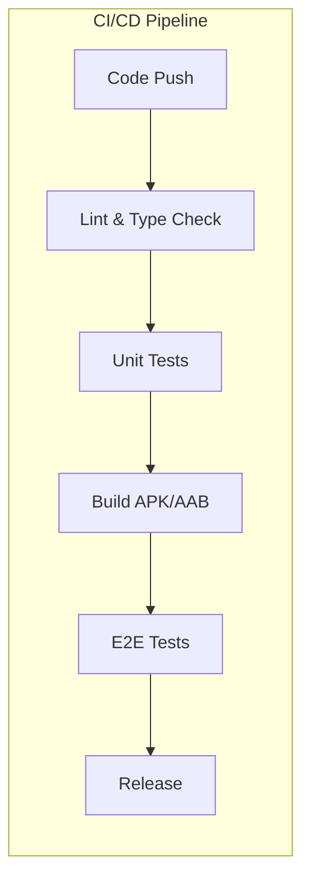

## Key Design Decisions

1. **Local-First Architecture**: All editing happens locally for 60fps responsiveness
2. **Debounced Sync**: 300ms debounce balances responsiveness with network efficiency
3. **Monaco Editor**: Same editor as VS Code for familiarity and features
4. **Tauri over React Native**: Better performance, smaller bundle, Rust backend
5. **Jotai over Redux**: Simpler API, better TypeScript support, atomic updates
6. **WebSocket for Real-time**: Lower latency than polling for sync updates

## Future Architecture

### Extension System

- WebAssembly-based plugin sandbox
- Capability-based security model


### Plugin Architecture

- Lazy loading for performance
- Isolated execution context

