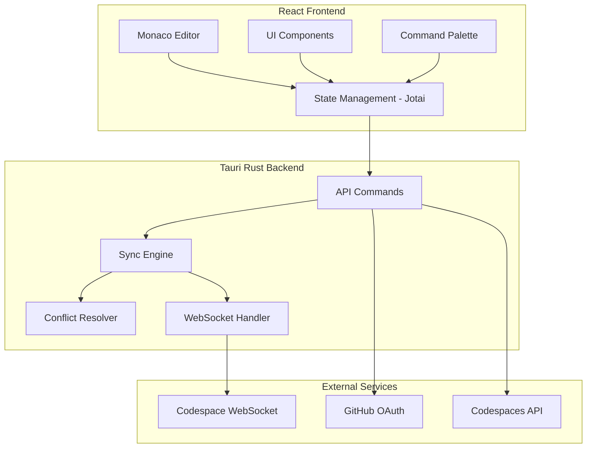

# VSCode Android

A production-ready VS Code-like Android application built with Tauri v2, featuring real-time GitHub Codespaces synchronization for lag-free mobile coding.


## Features

### Core Editor
- 📝 **Monaco Editor** - Full VS Code editor experience with IntelliSense, syntax highlighting, and multi-cursor editing
- 🎨 **VS Code Theming** - Dark/Light themes matching VS Code's appearance
- 📑 **Tab Management** - Multiple file tabs with dirty state tracking
- ⌨️ **Keyboard Shortcuts** - VS Code-compatible shortcuts adapted for mobile

### GitHub Codespaces Integration
- 🔐 **GitHub OAuth** - Secure authentication with token storage
- 🖥️ **Codespace Management** - List, start, stop, and connect to Codespaces
- 🔄 **Real-time Sync** - Bidirectional sync between local editor and remote Codespace
- 📡 **WebSocket Proxy** - Terminal and debugger output from Codespace

### Sync System
- ⚡ **Debounced Auto-sync** - Changes sync 300ms after typing stops
- 📴 **Offline Mode** - Full editing capability without network
- 🔄 **Sync Queue** - Pending changes queue for offline edits
- ⚖️ **Conflict Resolution** - Smart merge with last-write-wins fallback

### Mobile Optimizations
- 👆 **Touch-friendly UI** - 44px minimum touch targets
- 📱 **Responsive Layout** - Adapts to all screen sizes
- 🔄 **Gesture Support** - Swipe navigation, pull-to-refresh
- 📲 **Fullscreen Mode** - Distraction-free coding

## Architecture



## Tech Stack

| Layer | Technology |
|-------|------------|
| Framework | Tauri v2 (Android) |
| Frontend | React 18 + TypeScript |
| Build | Vite |
| Styling | Tailwind CSS |
| State | Jotai |
| Editor | Monaco Editor |
| Terminal | xterm.js |
| Backend | Rust |
| HTTP | reqwest |
| WebSocket | tungstenite |
| Diff | diffy |

## Project Structure

```
vscode-android/
├── src/                    # React frontend
│   ├── components/         # UI components
│   │   ├── ActivityBar.tsx
│   │   ├── AuthScreen.tsx
│   │   ├── CodespaceSelector.tsx
│   │   ├── CommandPalette.tsx
│   │   ├── EditorArea.tsx
│   │   ├── MainLayout.tsx
│   │   ├── SideBar.tsx
│   │   ├── SplashScreen.tsx
│   │   ├── StatusBar.tsx
│   │   └── TerminalPanel.tsx
│   ├── hooks/              # Custom React hooks
│   │   ├── useAuth.ts
│   │   ├── useCodespaces.ts
│   │   ├── useEditor.ts
│   │   └── useSync.ts
│   ├── lib/                # Utilities
│   │   └── utils.ts
│   ├── store/              # State management
│   ├── test/               # Test setup
│   ├── types/              # TypeScript types
│   │   └── index.ts
│   ├── App.tsx
│   ├── index.css
│   └── main.tsx
├── src-tauri/              # Rust backend
│   ├── src/
│   │   ├── codespaces.rs   # Codespaces API
│   │   ├── commands.rs     # Tauri commands
│   │   ├── conflict.rs     # Conflict resolution
│   │   ├── github.rs       # GitHub OAuth
│   │   ├── lib.rs          # Main entry
│   │   ├── sync.rs         # Sync engine
│   │   └── types.rs        # Rust types
│   ├── Cargo.toml
│   └── tauri.conf.json
├── e2e/                    # E2E tests
├── package.json
├── tailwind.config.js
├── tsconfig.json
└── vite.config.ts
```

## Getting Started

### Prerequisites

1. **Rust** (1.70+)
   ```bash
   curl --proto '=https' --tlsv1.2 -sSf https://sh.rustup.rs | sh
   ```

2. **Node.js** (18+)
   ```bash
   # Using nvm
   nvm install 18
   nvm use 18
   ```

3. **Android Studio** with:
   - Android SDK (API 24+)
   - Android NDK
   - CMake

4. **Tauri CLI**
   ```bash
   cargo install tauri-cli
   ```

5. **GitHub OAuth App**
   - Create at https://github.com/settings/developers
   - Set callback URL to your app's custom scheme

### Installation

```bash
# Clone the repository
git clone https://github.com/your-org/vscode-android.git
cd vscode-android

# Install dependencies
npm install

# Set environment variables
export GITHUB_CLIENT_ID="your_client_id"
export GITHUB_CLIENT_SECRET="your_client_secret"
```

### Development

```bash
# Run in development mode (desktop)
npm run tauri dev

# Run on Android device
npm run tauri:android:dev

# Build APK
npm run tauri:android:apk

# Build AAB for Play Store
npm run tauri:android:aab
```

### Testing

```bash
# Unit tests
npm run test

# E2E tests
npm run test:e2e

# Lint
npm run lint
```

## Configuration

### GitHub OAuth Setup

1. Go to GitHub Developer Settings
2. Create new OAuth App
3. Set Authorization callback URL to `vscode-android://oauth/callback`
4. Copy Client ID and Secret
5. Update `src-tauri/src/github.rs` with your credentials

### Android Signing

For production builds, configure signing in `tauri.conf.json`:

```json
{
  "bundle": {
    "android": {
      "keystorePath": "/path/to/keystore.jks",
      "keystorePassword": "your_password",
      "keyPassword": "your_key_password",
      "keyAlias": "your_alias"
    }
  }
}
```

## Keyboard Shortcuts

| Shortcut | Action |
|----------|--------|
| Ctrl+Shift+P | Command Palette |
| Ctrl+B | Toggle Sidebar |
| Ctrl+S | Save File |
| Ctrl+P | Quick Open |
| Ctrl+F | Find |
| Ctrl+H | Replace |
| Ctrl+` | Toggle Terminal |
| Esc | Close Panels |

## API Reference

### Tauri Commands

#### Authentication
- `github_login()` - Initiate OAuth flow
- `github_callback(code, state)` - Handle OAuth callback
- `get_github_user()` - Get current user
- `logout()` - Clear auth tokens

#### Codespaces
- `list_codespaces()` - List all codespaces
- `get_codespace(name)` - Get codespace details
- `start_codespace(name)` - Start a codespace
- `stop_codespace(name)` - Stop a codespace
- `create_codespace(repo, options)` - Create new codespace

#### Sync
- `sync_file_to_codespace(path, content)` - Push file changes
- `sync_file_from_codespace(path)` - Pull file from remote
- `push_all_changes()` - Flush pending changes
- `pull_all_changes()` - Pull remote changes
- `get_sync_status()` - Get current sync status

## Security

- 🔒 Tokens stored in encrypted Tauri Store
- 🔐 OAuth state verification (CSRF protection)
- 🛡️ CSP headers configured
- 🔑 No plaintext secrets in code

## Privacy

- All code editing happens locally
- Tokens never leave the device
- No telemetry by default
- Open source and auditable

## Troubleshooting

### Build Issues

**Problem**: `cargo build` fails with linker errors
```bash
# Solution: Install Android NDK and set environment
export ANDROID_NDK_HOME=$ANDROID_HOME/ndk/<version>
```

**Problem**: Gradle sync fails
```bash
# Solution: Clean and rebuild
cd src-tauri
cargo clean
cd ..
npm run tauri:android:build
```

### Runtime Issues

**Problem**: OAuth callback not working
- Ensure custom URL scheme is registered in AndroidManifest.xml
- Verify callback URL matches GitHub OAuth app settings

**Problem**: Sync not working
- Check network connectivity
- Verify GitHub token has `codespace` scope
- Check Codespace is in `available` or `running` state

## Contributing

1. Fork the repository
2. Create a feature branch (`git checkout -b feature/amazing-feature`)
3. Commit your changes (`git commit -m 'Add amazing feature'`)
4. Push to the branch (`git push origin feature/amazing-feature`)
5. Open a Pull Request

## License

MIT License - see [LICENSE](LICENSE) for details.

## Acknowledgments

- [Tauri](https://tauri.app/) - Cross-platform framework
- [Monaco Editor](https://microsoft.github.io/monaco-editor/) - Code editor
- [GitHub Codespaces](https://github.com/features/codespaces) - Cloud development
- [xterm.js](https://xtermjs.org/) - Terminal emulator

## Roadmap

- [ ] Extension support (VS Code compatible)
- [ ] Multi-root workspaces
- [ ] Integrated Git UI
- [ ] Debug adapter protocol support
- [ ] Pair programming mode
- [ ] Custom themes
- [ ] Plugin marketplace

## License

See [LICENSE](LICENSE) for details.
